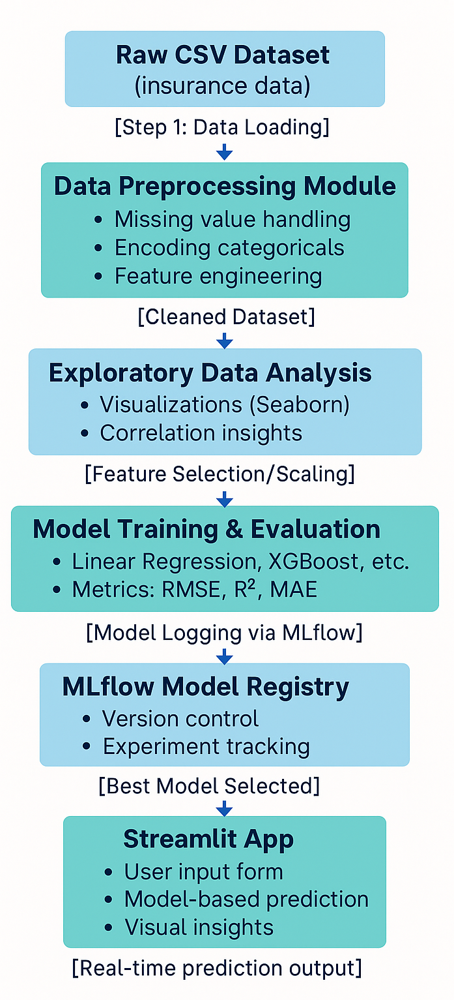

# Insurance-price-prediction
This project focuses on predicting medical insurance costs based on demographic and lifestyle factors The model is built using XGBoost, a powerful gradient boosting algorithm, and the results are visualized interactively in Streamlit with confidence intervals to quantify prediction uncertainty

## Features:-
1) Predicts insurance cost based on user input (age, BMI, gender, smoker status, number of children, region).
2) Uses XGBoost Regressor for high accuracy.
3) Estimates 95% Confidence Intervals using bootstrapping.
4) Interactive Streamlit app with Plotly charts.
5) Visual analysis of feature vs. predicted cost with shaded uncertainty bands.

📦 insurance-prediction
 ┣ 📜 app.py                # Streamlit application
 ┣ 📜 insurance.csv         # Dataset (replace with your dataset)
 ┣ 📜 xgboost_model.pkl     # Trained model (saved with joblib)
 ┣ 📜 requirements.txt      # Dependencies
 ┗ 📜 README.md             # Project documentation

## Dataset:-
1) Source: Insurance dataset (age, BMI, children, gender, smoker, region, charges).
2) Log transformation on charges.
3) Feature engineering: age_bmi_interaction, smoker_bmi_interaction.
4) One-hot encoding for categorical variables.

## Model:-
1) Algorithm: XGBoost Regressor
2) Parameters tuned: n_estimators, max_depth, learning_rate
3) Confidence intervals estimated via bootstrapping (100 resamples).
   
## Flowchart:-

## Results:-
1) Accurate predictions of medical insurance costs.
2) Visualized mean predictions with 95% CI bands.
3) User-friendly dashboard interface.
